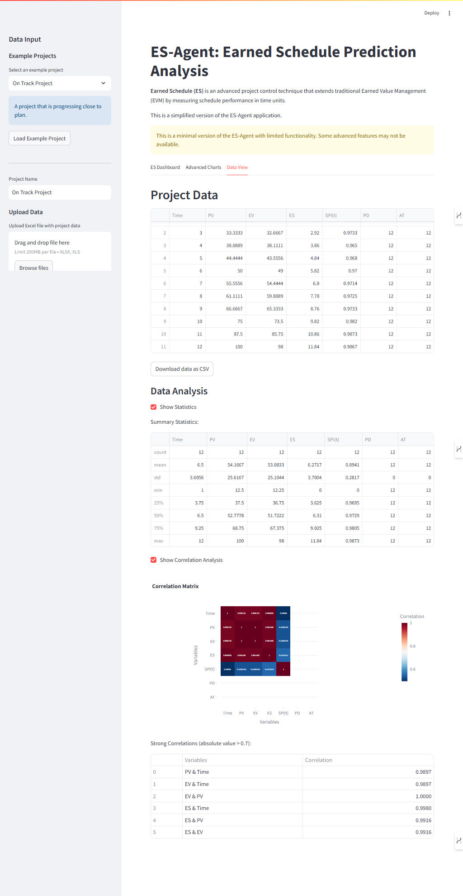

# ES-Agent: Earned Schedule Prediction Analysis

## Overview

ES-Agent is a sophisticated dashboard application designed for project managers and analysts who utilize Earned Schedule methodology for advanced project control. This tool leverages multiple forecasting models to predict project completion dates with precision based on historical performance data.

The development of this repository was inspired by the Earned Schedule Community in their development of Earned Schedule tools. To learn more visit https://www.earnedschedule.com/Calculator.shtml




## Key Features

- **Earned Schedule Metrics Calculation**:
  - Earned Schedule (ES)
  - Schedule Performance Index (time-based) SPI(t)
  - To Complete Schedule Performance Index (TSPI)
  - Independent Estimate at Completion (IEAC(t))
  - Project completion forecasting

- **Interactive Dashboard**:
  - Real-time calculation of ES metrics
  - Dynamic S-curve visualization
  - Performance indicators and interpretations
  - Advanced charts and comparative analysis
  - Monte Carlo simulation for completion forecasting

- **Project Management Utilities**:
  - Example project templates (On Track, Ahead of Schedule, Behind Schedule, etc.)
  - Data export/import capabilities
  - Interactive data analysis tools

- **AI-Powered Analysis**:
  - Intelligent interpretation of schedule trends
  - Automated risk assessment
  - Natural language processing for project insights

## Installation

```bash
# Clone the repository
git clone https://github.com/ai-in-pm/ES-Agent---Prediction-Analysis.git
cd ES-Agent---Prediction-Analysis

# Create and activate a virtual environment
python -m venv venv
# On Windows cmd:
venv\Scripts\activate.bat
# On Windows PowerShell (if permitted):
# .\venv\Scripts\Activate.ps1

# Install dependencies
pip install -r requirements.txt
```

### API Key Configuration

For AI-powered features, you'll need to set up an API key:

1. Create a `.env` file in the root directory of the project
2. Add your API key to the file in the following format:

```
AI_API_KEY=your_api_key_here
```

> **Note**: Never commit your `.env` file to version control. It's already included in the `.gitignore` file to prevent accidental uploads.

## Usage

The application has two versions:

### Minimal App (Recommended)

The minimal app provides core Earned Schedule functionality without external dependencies:

```bash
streamlit run minimal_app.py
```

This version includes:
- ES metrics calculation
- Interactive visualizations
- Example project templates
- Advanced charts and analysis tools

### Full App (Requires Additional Dependencies)

The full app includes advanced forecasting models using ARIMA, which requires additional dependencies:

```bash
# Install additional dependencies (pmdarima)
pip install pmdarima

# Run the full app
streamlit run app.py
```

## Data Structure

The application accepts data with the following structure:

| Time | PV  | EV  | PD  |
|------|-----|-----|-----|
| 1    | 10  | 8   | 10  |
| 2    | 20  | 16  | 10  |
| 3    | 30  | 27  | 10  |

Where:
- **Time**: The time period (e.g., weeks, months)
- **PV**: Planned Value at the given time
- **EV**: Earned Value at the given time
- **PD**: Planned Duration (total project duration)

## Example Projects

The application includes several example project templates:

- **On Track**: A project progressing as planned
- **Ahead of Schedule**: A project outperforming the schedule
- **Behind Schedule**: A project underperforming against the schedule
- **Recovery Project**: A project that starts behind but recovers
- **Slipping Project**: A project that starts well but slips later

## Contributing

Contributions are welcome! Please feel free to submit a Pull Request.

## License

This project is licensed under the MIT License - see the LICENSE file for details.
